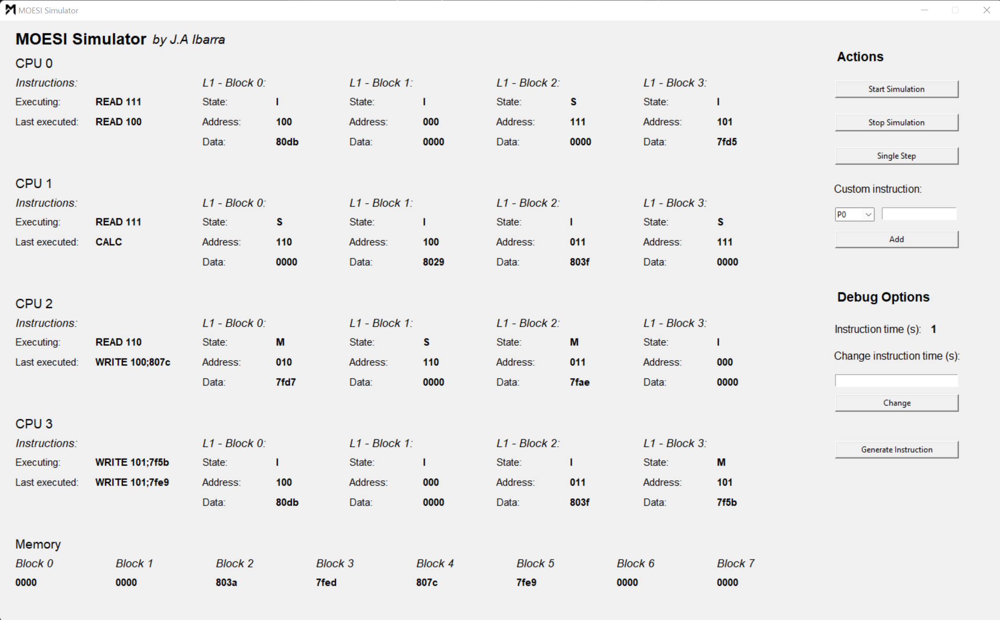
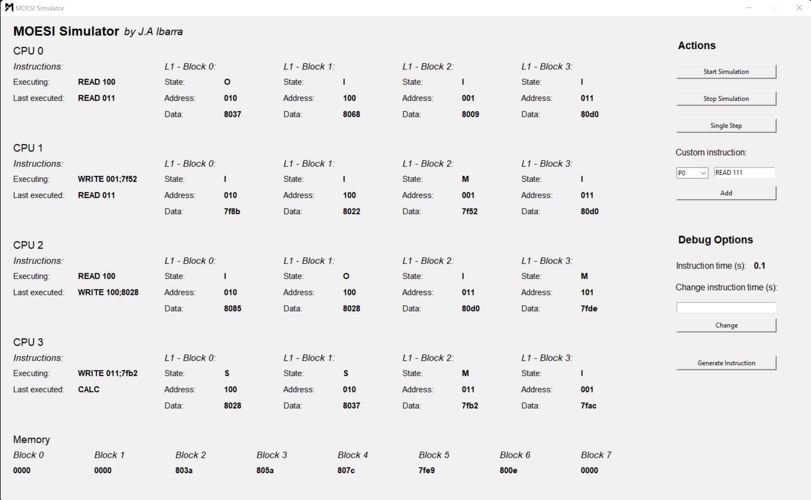

# MOESI Simulator

**MOESI Simulator** is a simple way to visualize the MOESI coherence protocol in Python. It features a simulator with four CPUs, each with four lines of L1 cache. The CPUs generate a random instruction each cycle. Possible instruction types are READ address (read from cache), WRITE address;data (write to cache) and CALC (a placeholder that means "calculate stuff").

The simple tkinter UI lets you see the state of the whole system, including current instruction, last executed instruction, and the full state of every cache block. It also features a main memory with a fake time penalty of 1 second. (for simulation purposes)

Instructions for use are quite simple.

* **Start Simulation:** Starts a random simulator where each CPU generates an instruction on a separate thread, executes it, and updates the system accordingly.
* **Stop Simulation:** Stops all threads of the simulation.
* **Single Step:** Only executes one cycle. (random instructions or custom instructions)
* **Custom instruction entry:** You may introduce a custom instruction for a specific CPU that matches the format given above or seen in the "Executing" and "Last executed" labels. Click the "Add" button and it will be executed on the next cycle either by using single step or continuous modes.
* **Instruction time:** Default is 1, can be modified to go faster.
* **Generate Instruction:** Just a quick print test for random instruction generator.

NOTE: A more detailed explanation of full system architecture and implementation details can be found in the included paper (/docs folder). This document is in Spanish.

## Photos 📷

Example 1                        |Example 2                      |
:------------------------------:|:------------------------------:
  |  


### Prerequisites 👓

Software you need to install to run this project:

```
Python 3.10 or higher. due to the use of match/case statements
```

### Installing 💻

On a Python default environment, execute main.py.

## Author 👨🏻‍💻

* **Alejandro Ibarra** - *Developer & Designer* - [AlejandroIbarraC](https://github.com/AlejandroIbarraC)

## License 📄

This project is licensed under the MIT License - see the [LICENSE.md](LICENSE.md) file for details

## Acknowledgments 📎

* Costa Rica Institute of Technology
* Kevin Cordero - [kevinscorzu](https://github.com/kevinscorzu)

<p align="center">This project was made with academical purposes. J.A Ibarra. 2022</p
```
